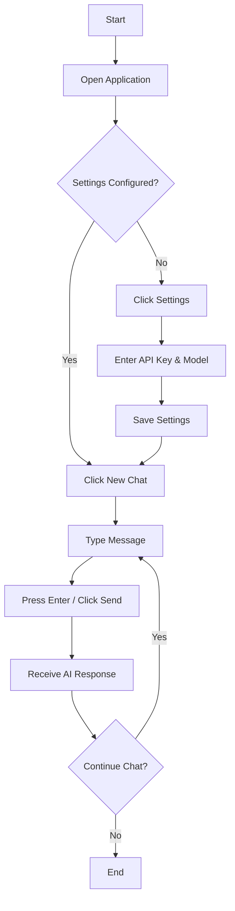
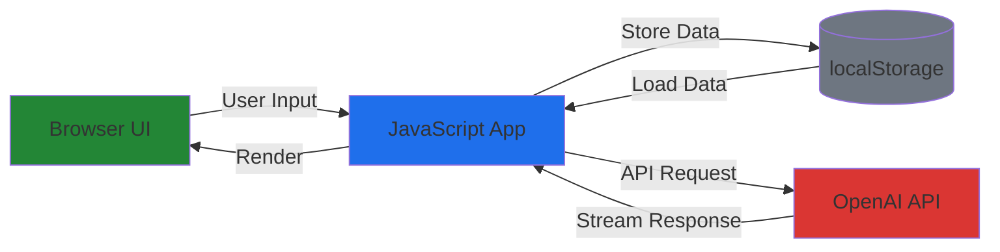
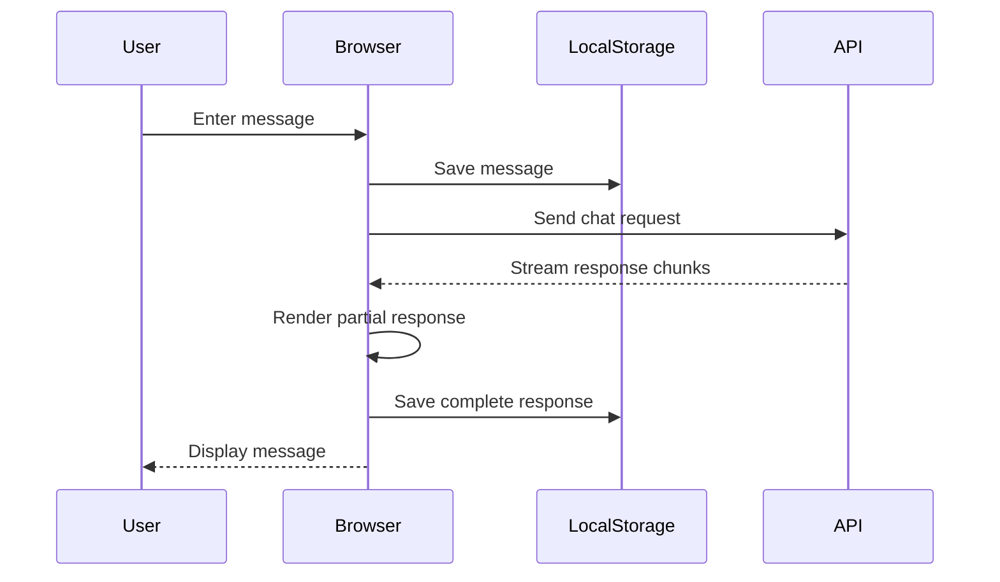

# xsukax Custom OpenAI WebUI

A lightweight, privacy-focused web interface for interacting with OpenAI-compatible APIs. This single-file application provides a feature-rich chat experience with complete client-side data management, ensuring your conversations and API credentials never leave your device.


## 🎯 Project Overview

xsukax Custom OpenAI WebUI is a standalone web application that enables seamless interaction with OpenAI's API and compatible language model APIs. Built as a self-contained HTML file, it offers a complete chat interface with conversation management, markdown rendering, and advanced features like thinking process visualization—all while maintaining absolute privacy through client-side data storage.

The application is designed for developers, researchers, and AI enthusiasts who require direct API access without relying on third-party platforms or cloud storage solutions.

## 🔒 Security and Privacy Benefits

This application prioritizes user security and data privacy through several architectural decisions:

- **Zero Server Dependencies**: All data processing occurs entirely within your browser, eliminating intermediary servers that could intercept or store your information
- **Local-Only Data Storage**: Conversations, settings, and API credentials are stored exclusively in your browser's localStorage, never transmitted to external servers
- **Direct API Communication**: Messages are sent directly from your browser to the configured API endpoint without proxying through third-party services
- **No Telemetry or Tracking**: The application contains no analytics, tracking scripts, or external dependencies that could compromise your privacy
- **Open Source Transparency**: The complete source code is available for audit, ensuring no hidden functionality or data collection mechanisms
- **Client-Side Encryption Ready**: Since all data remains local, you can implement additional browser-based encryption tools for enhanced security
- **Portable and Self-Contained**: Operates as a single HTML file, reducing attack surface and simplifying security audits

## ✨ Features and Advantages

### Core Functionality
- **Multi-Conversation Management**: Create, rename, delete, and switch between multiple chat sessions effortlessly
- **Real-Time Streaming Responses**: Experience fluid, token-by-token message generation with the ability to stop responses mid-stream
- **Thinking Process Visualization**: Displays AI reasoning steps when using models that support thinking tags (`<think>`, `<thinking>`)
- **Advanced Markdown Rendering**: Full support for formatted text, code blocks with syntax highlighting, tables, lists, and more
- **Flexible Model Selection**: Fetch available models directly from your API or manually specify model names

### Data Management
- **Conversation Export**: Save chat history in JSON format (full data) or plain text format (human-readable)
- **Settings Import/Export**: Backup and restore your API configuration across devices
- **Persistent Storage**: Automatically saves all conversations locally for seamless continuation across sessions

### User Experience
- **GitHub-Inspired Dark Theme**: Professional, eye-friendly interface optimized for extended use
- **Responsive Design**: Clean layout that adapts to different screen sizes
- **Keyboard Shortcuts**: Press Enter to send, Shift+Enter for new lines
- **One-Click Copy**: Easily copy messages including thinking processes to your clipboard
- **Auto-Resizing Input**: Text area automatically adjusts height as you type

### Technical Advantages
- **Zero Installation**: No npm packages, build tools, or dependencies required
- **Universal Compatibility**: Works on any modern browser without plugins
- **Offline Capable**: Once loaded, operates without internet connection (except for API calls)
- **Resource Efficient**: Minimal footprint with no background processes or service workers

## 📋 Installation Instructions

### Method 1: Direct Download
1. Download the `index.html` file from the [GitHub repository](https://github.com/xsukax/xsukax-Custom-OpenAI-WebUI)
2. Save it to any location on your computer
3. Open the file in a modern web browser (Chrome, Firefox, Safari, Edge)

### Method 2: Clone Repository
```bash
git clone https://github.com/xsukax/xsukax-Custom-OpenAI-WebUI.git
cd xsukax-Custom-OpenAI-WebUI
# Open index.html in your browser
```

### Method 3: Deploy to Web Server
Host the `index.html` file on any web server:

```bash
# Using Python's built-in server
python -m http.server 8000

# Using Node.js http-server
npx http-server -p 8000

# Using PHP
php -S localhost:8000
```

Then navigate to `http://localhost:8000` in your browser.

### Requirements
- Modern web browser with JavaScript enabled
- Internet connection for API requests
- OpenAI API key or compatible API endpoint

## 📖 Usage Guide

### Initial Setup

1. **Configure API Settings**
   - Click the ⚙️ Settings button in the top-right corner
   - Enter your API URL (default: `https://api.openai.com/v1/chat/completions`)
   - Enter your API Key (obtain from [OpenAI Platform](https://platform.openai.com/api-keys))
   - Click "🔄 Fetch Models" to retrieve available models from your API
   - Select your preferred model from the dropdown
   - Click "Save" to store your configuration

2. **Alternative: Manual Model Input**
   - If model fetching fails, switch to "Manual Input" mode
   - Enter the model name directly (e.g., `gpt-4`, `gpt-3.5-turbo`)
   - Save your settings

### Basic Operations



### Conversation Management

**Creating Conversations**
- Click "+ New Chat" in the sidebar to start a fresh conversation
- The first message you send automatically becomes the conversation title

**Switching Conversations**
- Click any conversation in the sidebar to switch to it
- The active conversation is highlighted in blue

**Renaming Conversations**
- Hover over a conversation and click the ✏️ icon
- Enter a new name and confirm

**Deleting Conversations**
- Hover over a conversation and click the 🗑️ icon
- Confirm the deletion when prompted

**Exporting Conversations**
- Hover over a conversation and click the 💾 icon
- Choose between Text (readable) or JSON (complete data) format

### Message Interaction

**Copying Messages**
- Hover over any message to reveal the "📋 Copy" button
- Click to copy the message content to your clipboard
- For assistant messages, this includes both thinking process and response

**Stopping Responses**
- During message generation, the "Send" button changes to "Stop"
- Click "Stop" to halt the streaming response immediately

**Understanding Thinking Processes**
- Messages with thinking tags display a collapsible "🧠 Thinking Process" section
- Click the header to expand/collapse the reasoning steps
- Token count estimation is shown as a badge

### Application Architecture



### Data Flow



### Advanced Features

**Settings Export/Import**
- Use "📤 Export" to save your API configuration
- Use "📥 Import" to restore settings on another device
- Useful for backup or synchronization across browsers

**Compatible APIs**
This application works with any OpenAI-compatible API:
- OpenAI API (official)
- Azure OpenAI Service
- LocalAI
- Text Generation WebUI
- Oobabooga
- Any API following the OpenAI chat completions format

Simply update the API URL in settings to point to your endpoint.

## 🔧 Troubleshooting

**Issue: "Failed to fetch models"**
- Verify your API URL is correct and accessible
- Check that your API key is valid and has proper permissions
- Switch to "Manual Input" mode and enter the model name directly

**Issue: API errors during chat**
- Confirm your API key hasn't expired
- Verify the selected model is available with your API plan
- Check browser console for detailed error messages

**Issue: Messages not persisting**
- Ensure browser localStorage is enabled
- Check that you haven't reached storage quota limits
- Some browsers in private/incognito mode may not persist data

**Issue: Streaming not working**
- Verify your API supports streaming responses
- Some proxy configurations may interfere with SSE (Server-Sent Events)
- Check browser console for connection errors

## 🤝 Contributing

Contributions are welcome! Please feel free to submit issues, fork the repository, and create pull requests for any improvements.

## 📄 License

This project is licensed under the GNU General Public License v3.0.

---

**Repository**: [github.com/xsukax/xsukax-Custom-OpenAI-WebUI](https://github.com/xsukax/xsukax-Custom-OpenAI-WebUI)

**Created by**: xsukax
